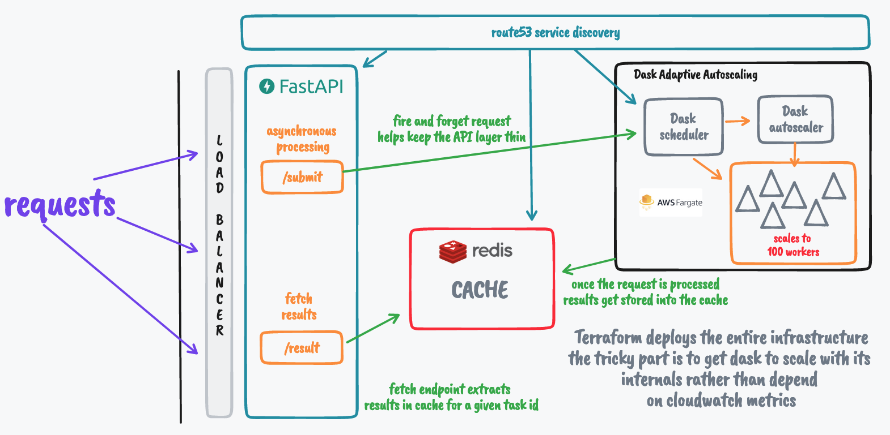

# Asynchronous API using Dask

- Do you use [Dask](https://docs.dask.org/en/) to parallelize your computational tasks? 
- Do you wish to expose these tasks through a convenient asynchronous API? 
- Are you contemplating the deployment of this system in AWS, particularly an EC2 or Fargate cluster?

If you've answered "yes" to any of these questions, you've come to the right place! This repository demonstrates a simple usecase to compute [fibonacci](https://examples.dask.org/applications/async-web-server.html) & provides infrastructure and deployment scripts for AWS. These resources not only facilitate the setup of a Dask cluster but also adapts the cluster seamlessly to varying workloads. Additionally, it allows you to make these services accessible through FastAPI.

## Developers and Deployment

This system relies on an AWS Fargate cluster, entirely orchestrated using [Terraform](https://www.terraform.io/) and eliminates the need for manual configurations. It leverages AWS's Fargate offering and spot instances to enable on-demand scaling.

You'll find Terraform scripts and modules in the [deployment](./deployment/) directory.



The system contains 3 main components -

### API Layer

This component is quite straightforward, using [FastAPI](https://fastapi.tiangolo.com/) to handle incoming client requests. Requests are processed asynchronously, providing clients immediately with a `task_id`. These `task_id`'s are systematically generated from the request parameters, avoiding redundant processing of identical requests. The results for each request are stored using their respective `task_id` as the key in the **Redis** cache. The API layer follows a *fire-and-forget mechanism*, i.e. once the request is submitted to Dask, relinquishes control and is no longer responsible for its execution.

### Dask System

If you're new to Dask, I recommend reading more about it [here](https://dask.org/) & [here](https://cloudprovider.dask.org/en/latest/aws.html#fargate)

This is the most trickiest part of the deployment process. Typically, autoscaling in cloud environments relies on metrics gathered through CloudWatch, triggering alarms to scale resources up or down. 

However, Dask prefers to have complete control over autoscaling, and it does so remarkably well. Dask constantly collects internal metrics, such as request processing and pending tasks in the queue, worker availability, resource usage, and historical data on resource utilization for specific tasks. It uses this wealth of information to dynamically adjust the number of worker nodes required to process incoming requests efficiently.

To achieve this:

- **Autoscaling Node**: As requests come in, this node scales the number of worker nodes based on demand.check the [Terraform](./deployment/) code for the necessary permissions, roles, and policies. 

- **Scheduler Node**: In Dask terminology, the scheduler node is responsible for job distribution and communication with worker nodes. It also provides reliability in cases of job or worker node failures. 

  By default, if we let Dask manage its cluster entirely, it will spin up both the scheduler and worker nodes. However, this approach lacks control over the scheduler, which needs to be registered with service discovery on AWS for accessibility within the EC2/Fargate cluster. To simplify this process, we explicitly create a scheduler node, register it with service discovery, and ensure it's accessible within the cluster.

  In the Terraform scripts, this process unfolds as follows: we first create a **Scheduler** Node, register it with service discovery, wait for the node to become fully operational, and capture its IP. We then pass the instance IP to the Autoscaling Node through an environment variable. You can inspect how `scheduler_address`` to the [autoscaling node](./dask-awsdeploy/dask_cluster.py).

- **Worker Node**: The real computational work takes place in the worker nodes within the Dask system. This deployment guarantees the presence of at least one active worker node, with the ability to scale up to a maximum (currently set to 100) number of workers. All workers are automatically registered with the scheduler upon creation, and the creation of worker nodes is managed by the ***autoscaling*** node.

  ***While it's possible to achieve even greater speed and scalability with a more generous budget ($$$), the system currently limits the scaling to 100 dask workers.***

- **Cache layer**: This component plays a pivotal role in storing results for all processed requests. The cache system also ensures that results aren't recomputed for identical requests, tying back to the discussion of systematically generating `task_id`s based on query parameters.

### local development

For local development, follow these steps:

Build the Docker images locally

```sh
docker compose build
```

Launch the stack:

```sh
docker compose up
```
